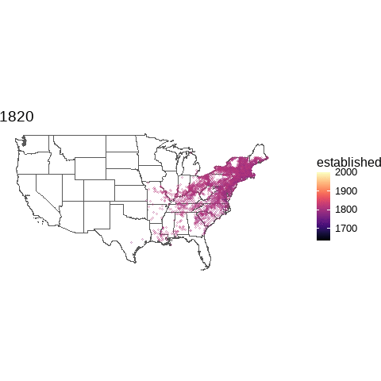

# Setup

```{r setup}
knitr::opts_chunk$set(echo = F, message = F)

pacman::p_load(pacman, tidyverse, janitor, here)

theme_set(theme_bw())

```

# 20210401 - `ggtern` and `palmerpenguins`

```{r, include = F, echo = F}
p_load(ggtern, palmerpenguins)


penguins2 <- penguins %>% 
  mutate(year = as.factor(year)) %>% 
  mutate_if(is.numeric, scale)

(p <- ggtern(penguins2, aes(bill_length_mm, bill_depth_mm, flipper_length_mm, color = species)) + 
  geom_point(shape = 1) + 
    theme_nomask()
)


```

```{r}
data("Feldspar")

ggtern(Feldspar, aes(Ab, Or, An, color = Feldspar)) + 
  geom_point() + 
  theme_nomask()
```


# 20210402 - `babynames`

```{r, include = F}
p_load(babynames)
theme_set(theme_bw())


#browseURL("https://towardsdatascience.com/how-popular-is-your-name-mini-data-viz-challenge-in-r-1dc31f6a22dc")


# babynames %>% 
#   arrange(desc(n)) %>% 
#   head(20)

```

```{r, eval = F, include = F}
#babynames %>% 
#  ggplot(aes(year, n)) + 
#  geom_point()
```

```{r}
babynames %>% 
  filter(name %in% c("Clark", "Jack"), sex == "M") %>% 
  ggplot(aes(year, n, color = name)) + 
  geom_point()

babynames %>% 
  filter(name %in% c("Kimberly", "Raney", "Ruth"), sex == "F") %>% 
  ggplot(aes(year, n, color = name)) + 
  geom_point()

```

# 20210405 - Urban Growth - Valencia

This is from a tutorial by Dominic Roye. I'd like to try other cities in the future.

This also uses rvest a little bit.

```{r, include=F}
#browseURL("https://dominicroye.github.io/en/2019/visualize-urban-growth/")

p_load(sf, fs, lubridate, feedeR, tmap, classInt, sysfonts, showtext, rvest)


```

```{r, include=F}
url <- "http://www.catastro.minhap.es/INSPIRE/buildings/ES.SDGC.bu.atom.xml"

prov_enlaces <- feed.extract(url)
str(prov_enlaces)

prov_enlaces_tab <- as_tibble(prov_enlaces$items) %>% 
                       mutate(title = repair_encoding(title))

val_atom <- filter(prov_enlaces_tab, str_detect(title, "Valencia")) %>% pull(link)

# import the RSS
val_enlaces <- feed.extract(val_atom)

# get the table with the download links
val_enlaces_tab <- val_enlaces$items
val_enlaces_tab <- mutate(val_enlaces_tab, title = repair_encoding(title),
                          link = repair_encoding(link)) 

val_link <- filter(val_enlaces_tab, str_detect(title, "VALENCIA")) %>% pull(link)

# create a temporary file
temp <- tempfile()

# download the data
#download.file(URLencode(val_link), temp)

# unzip to a folder called buildings
#unzip(temp, exdir = "buildings")


# get the path with the file
file_val <- dir_ls("buildings", regexp = "building.gml")

# import the data
buildings_val <- st_read(file_val)

buildings_val <- mutate(buildings_val, 
               beginning = str_replace(beginning, "^-", "0000") %>% 
                            ymd_hms() %>% as_date()
               )

#font download
sysfonts::font_add_google("Montserrat", "Montserrat")

#use showtext for fonts
showtext::showtext_auto() 

filter(buildings_val, beginning >= "1750-01-01") %>%
 ggplot(aes(beginning)) + 
    geom_density(fill = "#2166ac", alpha = 0.7) +
  scale_x_date(date_breaks = "20 year", 
               date_labels = "%Y") +
  theme_minimal() +
  theme(title = element_text(family = "Montserrat"),
        axis.text = element_text(family = "Montserrat")) +
  labs(y = "",x = "", title = "Evolution of urban development")

# get the coordinates of Valencia
ciudad_point <- tmaptools::geocode_OSM("Valencia", 
                                      as.sf = TRUE)

#  project the points
ciudad_point <- st_transform(ciudad_point, 25830)

# create the buffer
point_bf <- st_buffer(ciudad_point, 2500)


# get the intersection between the buffer and the building
buildings_val25 <- st_intersection(buildings_val, point_bf)

br <- classIntervals(year(buildings_val25$beginning), 15, "quantile")

lab <- names(print(br, under = "<", over = ">", cutlabels = FALSE))

buildings_val25 <- mutate(buildings_val25, 
               yr_cl = cut(year(beginning), br$brks, labels = lab, include.lowest = TRUE))

```

```{r}
# colours
col_spec <- RColorBrewer::brewer.pal(11, "Spectral")

# colour ramp function
col_spec_fun <- colorRampPalette(col_spec)


# create the final map
tm_shape(buildings_val25) +
  tm_polygons("yr_cl", 
              border.col = "transparent",
              palette = col_spec_fun(15),
              textNA = "Without data",
              title = "") +
 tm_layout(bg.color = "black",
           outer.bg.color = "black",
           legend.outside = TRUE,
           legend.text.color = "white",
           legend.text.fontfamily = "Montserrat", 
            panel.label.fontfamily = "Montserrat",
            panel.label.color = "white",
            panel.label.bg.color = "black",
            panel.label.size = 5,
            panel.label.fontface = "bold")
```


# 20210406 - #TidyTuesday - Deforestation

```{r, include = F}
p_load(tidytuesdayR, visdat, gghighlight)

tt <- tt_load("2021-04-06")
readme(tt)

deforest <- tt %>% reduce(left_join) %>% 
  select(-c(6:16)) %>% 
  mutate(country_year = paste0(entity, "_", year))

vis_dat(deforest)

sum_deforest <- deforest %>% 
  distinct(country_year, .keep_all = T)

```

```{r}
sum_deforest %>% 
  filter(entity != "World") %>% 
  ggplot(aes(year, net_forest_conversion, color = entity)) + 
  geom_point(show.legend = F) + 
  geom_line(show.legend = T) + 
  gghighlight(abs(net_forest_conversion) > 1000000, use_group_by = F) + 
  scale_y_continuous(labels = scales:: comma) + 
  labs(x = "Year", y = "Net Forest Conversion")


# Try to change shape based on net loss or gain (China)
sum_deforest %>% 
  filter(entity != "World") %>% 
  ggplot(aes(year, forest_area, color = entity)) + 
  geom_point(show.legend = F) + 
  geom_line(show.legend = F) + 
  gghighlight(forest_area > 2.2, use_group_by = F) + 
  scale_y_continuous(labels = scales:: comma) + 
  labs(x = "Year", y = "Change in Percent of Global Forest Area")

```

# 20210407 - More #TidyTuesday - Deforestation

```{r}
sum_deforest %>% 
  mutate(direction = case_when(net_forest_conversion >= 0 ~ "Gain",
                               net_forest_conversion < 0 ~ "Loss")) %>% 
  filter(entity != "World") %>% 
  ggplot(aes(year, forest_area, color = entity, lty = direction)) + 
  geom_point(show.legend = F) + 
  geom_line(show.legend = T) + 
#  geom_label(aes(year, forest_area, color = entity, lty = direction,label = entity), data = subset(sum_deforest, year == 2015 & forest_area > 2.5)) +
  scale_y_continuous(labels = scales:: comma) + 
  labs(x = "Year", y = "Change in Percent of Global Forest Area") + 
  guides(color = FALSE)

sum_deforest %>% 
  mutate(direction = case_when(net_forest_conversion >= 0 ~ "Gain",
                               net_forest_conversion < 0 ~ "Loss")) %>% 
  filter(entity != "World") %>% 
  ggplot(aes(year, net_forest_conversion, color = entity, lty = direction)) + 
  geom_point(show.legend = F) + 
  geom_line(show.legend = T) + 
#  gghighlight(forest_area > 2.2, use_group_by = F) + 
  scale_y_continuous(labels = scales:: comma) + 
  labs(x = "Year", y = "Change in Percent of Global Forest Area") + 
  guides(color = FALSE)
```

# 20210408 - Zoo

I took the day off to go to the [zoo](https://www.littlerockzoo.com/) with the kids. 


# 20210409 - `inspiRe` and `praise`

```{r}
p_load(praise, inspiRe)

praise()

inspire_me()


#inspire_me(open = T)

```

# 20210412 - `breakerofchains`

breakerofchains is used when you have a chained snippet of code. You can put your cursor anywhere and use the addin to run the code up to your cursor.

```{r}
p_load(breakerofchains)

df <- datasets::chickwts


df %>% 
  group_by(feed) %>% 
  summarize(mean = mean(weight)) %>% 
  ggplot(aes(reorder(feed, mean), mean)) + 
  geom_point()
  

```


# 20210413 - #TidyTuesday - Post Offices

```{r, include = F}
p_load(tidytuesdayR, rnaturalearth, viridis)

tt <- tt_load("2021-04-13")$post_offices %>% 
  mutate(established = case_when(established < 1500 ~ established * 10, 
                                 TRUE ~ established))

#readme(tt)

rne_map <- ne_states(returnclass = "sf", country='United States of America')


#browseURL("https://github.com/tidyverse/ggplot2/issues/3391")

```

```{r, include = T, eval = T}

# ggplot(rne_map) + 
#   geom_sf(fill = NA) + 
#   geom_point(data=tt[which(tt$established <= 1820 & 
#                                        (tt$discontinued > 1820 | is.na(tt$discontinued))) ,],
#              aes(x=longitude, y=latitude),
#              colour='navy', size=0.35) +
#   xlim(-125, -60) + 
#   ylim(25, 50) + 
#   theme_void()

ggplot(rne_map) + 
  geom_sf(fill = NA, aes(geometry = geometry)) + 
  geom_point(data=tt[which(tt$established <= 2020 & 
                                       (tt$discontinued > 1820 | is.na(tt$discontinued))) ,],
             aes(x=longitude, y=latitude,
             colour= established), size = 1, alpha = 0.5, shape = 1) +
  xlim(-125, -60) + 
  ylim(25, 50) + 
  scale_color_viridis(option = "magma") + 
  theme_void()


```

# 20210414 - More Post Offices

animate a map for every 100 years

```{r, include = F, eval = F}

(map_1820 <- ggplot(rne_map) + 
  geom_sf(fill = NA, aes(geometry = geometry)) + 
  geom_point(data=tt[which(tt$established <= 1820 & 
                                       (tt$discontinued > 1820 | is.na(tt$discontinued))) ,],
             aes(x=longitude, y=latitude,
             color= established), size = 1, alpha = 0.5, shape = 1) +
  xlim(-125, -60) + 
  ylim(25, 50) + 
  scale_color_viridis(option = "magma", limits = c(1635, 2000)) + 
  labs(title = 1820) +
  theme_void()
)

(map_1850 <- ggplot(rne_map) + 
  geom_sf(fill = NA, aes(geometry = geometry)) + 
  geom_point(data=tt[which(tt$established <= 1850 & 
                                       (tt$discontinued > 1820 | is.na(tt$discontinued))) ,],
             aes(x=longitude, y=latitude,
             colour= established), size = 1, alpha = 0.5, shape = 1) +
  xlim(-125, -60) + 
  ylim(25, 50) + 
  scale_color_viridis(option = "magma", limits = c(1635, 2000)) + 
  labs(title = 1850) +
  theme_void()
)

(map_1880 <- ggplot(rne_map) + 
  geom_sf(fill = NA, aes(geometry = geometry)) + 
  geom_point(data=tt[which(tt$established <= 1880 & 
                                       (tt$discontinued > 1820 | is.na(tt$discontinued))) ,],
             aes(x=longitude, y=latitude,
             colour= established), size = 1, alpha = 0.5, shape = 1) +
  xlim(-125, -60) + 
  ylim(25, 50) + 
  scale_color_viridis(option = "magma", limits = c(1635, 2000)) + 
  labs(title = 1880) +
  theme_void()
)

(map_1920 <- ggplot(rne_map) + 
  geom_sf(fill = NA, aes(geometry = geometry)) + 
  geom_point(data=tt[which(tt$established <= 1920 & 
                                       (tt$discontinued > 1820 | is.na(tt$discontinued))) ,],
             aes(x=longitude, y=latitude,
             colour= established), size = 1, alpha = 0.5, shape = 1) +
  xlim(-125, -60) + 
  ylim(25, 50) + 
  scale_color_viridis(option = "magma", limits = c(1635, 2000)) + 
  labs(title = 1920) +
  theme_void()
)

(map_2020 <- ggplot(rne_map) + 
  geom_sf(fill = NA, aes(geometry = geometry)) + 
  geom_point(data=tt[which(tt$established <= 2020 & 
                                       (tt$discontinued > 1820 | is.na(tt$discontinued))) ,],
             aes(x=longitude, y=latitude,
             colour= established), size = 1, alpha = 0.5, shape = 1) +
  xlim(-125, -60) + 
  ylim(25, 50) + 
  scale_color_viridis(option = "magma") + 
  labs(title = 2020) +
  theme_void() 
)

```

```{r, include = F, eval = F}
all_map <- ggplot(rne_map) + 
  geom_sf(fill = NA, aes(geometry = geometry)) + 
  geom_point(data=tt[which(tt$established <= 1820 & 
                                       (tt$discontinued > 1820 | is.na(tt$discontinued))) ,],
             aes(x=longitude, y=latitude,
             colour= established), size = 1, alpha = 0.5, shape = 1)  + 
  geom_point(data=tt[which(tt$established <= 1920 & 
                                       (tt$discontinued > 1820 | is.na(tt$discontinued))) ,],
             aes(x=longitude, y=latitude,
             colour= established), size = 1, alpha = 0.5, shape = 1)  + 
  geom_point(data=tt[which(tt$established <= 2020 & 
                                       (tt$discontinued > 1820 | is.na(tt$discontinued))) ,],
             aes(x=longitude, y=latitude,
             colour= established), size = 1, alpha = 0.5, shape = 1) +
  xlim(-125, -60) + 
  ylim(25, 50) + 
  scale_color_viridis(option = "magma") + 
  theme_void()

```

```{r, warning = F, message = F, echo = F, include = F, eval = F}
p_load(animation)

animation::saveGIF(
  expr = {
    plot(map_1820)
    plot(map_1850)
    plot(map_1880)
    plot(map_1920)
    plot(map_2020)
  },
  movie.name = "postofficesmap.gif"
)
```



# 20210415 - `ggtern` with USArrests dataset

```{r, include = F}
p_load(ggtern, ggrepel)

df <- datasets::USArrests %>% 
  clean_names() %>% 
  rownames_to_column("state")

visdat::vis_dat(df)

range_0_1 <- function(x, ...){(x-min(x, ...))/(max(x, ...)-min(x, ...))}

df2 <- df %>% 
  mutate(across(.cols = c(murder, assault, rape), .fns = range_0_1))
```

```{r}
(p1 <- ggtern(df2, aes(x = murder, y = assault, z = rape, color = urban_pop)) + 
  geom_point(shape = 1) + 
#  geom_label(aes(label = state)) + 
  theme_nomask()
)

(p2 <- ggtern(df2, aes(x = murder, y = assault, z = rape, color = urban_pop, label = state)) + 
  geom_point(shape = 1) + 
#  geom_label(aes(label = state)) +
  Tlab("Assault") + Llab("Murder") + Rlab("Rape") +
  theme_showarrows() + 
  theme_nomask()
)

```


# 20210416 - Trying `gganimate` 

```{r, include = F, eval = F}
p_load(gganimate)


base_plot <- ggplot(rne_map) + 
  geom_sf(fill = NA, aes(geometry = geometry)) + 
  xlim(-125, -60) + 
  ylim(25, 50) + 
  theme_void()


po_est_plot <- base_plot +  
  geom_point(data = tt, aes(longitude, latitude, color = established), size = 0.0001) +
  scale_color_viridis(option = "magma") + 
  transition_manual(established, cumulative = TRUE) +
  labs(title = "{current_frame}")
```


```{r, eval = F, include = F}
anim <- animate(po_est_plot)

anim_save("US_postoffices_est.gif", anim)
```


# 20210419 - MLB locations with `st_read()` and `ggiraph`

```{r, include = F}
p_load(sf, rnaturalearth, ggiraph)

rne_map <- ne_states(returnclass = "sf", country='United States of America')


mlb_locations <- sf::st_read("mlb_locs.kml") # saved from Wikipedia

mlb_teams_p <- ggplot(rne_map) + 
  geom_sf(fill = NA, aes(geometry = geometry)) + 
  xlim(-125, -60) + 
  ylim(25, 50) + 
  theme_void() + 
  geom_sf(data = mlb_locations, aes(geometry = geometry), shape = 1)


mlb_teams_p_int <- ggplot(rne_map) + 
  geom_sf(fill = NA, aes(geometry = geometry), lwd = 0.1) + 
  xlim(-125, -60) + 
  ylim(25, 50) + 
  theme_void() +
  geom_sf_interactive(data = mlb_locations, aes(geometry = geometry, tooltip = Name))

```

```{r}
girafe(ggobj = mlb_teams_p_int,
       width_svg = 6, 
       height_svg = 6 * 0.618
       )
```


# 20210420 - #TidyTuesday - Netflix

```{r}
p_load(tidytuesdayR)

tt <- tt_load("2021-04-20")$netflix_titles

length_min <- tt %>% 
  filter(str_detect(duration, "min")) %>% 
  mutate(duration_min = parse_number(duration))

length_season <- tt %>% 
  filter(!str_detect(duration, "min")) %>% 
  mutate(duration_season = parse_number(duration))

```

```{r}
length_min %>% 
  filter(release_year >= 1997) %>% 
  ggplot(aes(as.factor(release_year), duration_min, color = rating)) + 
  geom_point(shape = 1, alpha = 0.5) + 
  coord_flip()


```


# 20210421 - `terrainr` and `rayshader` - Petit Jean State Park Elevation and Mt. Elbert

This framework works, but it is slow and results in multiple output files. I'm not sure how to combine them. 

```{r, eval = F, include = F}
p_load(terrainr, sf, raster, progressr)

petit_jean_points <- data.frame(
  lat = runif(100, min = 35.118785, max = 35.177737),
  lng = runif(100, min = -92.958877, max = -92.849823)
) %>% 
  st_as_sf(coords = c("lng", "lat")) %>% 
  st_set_crs(4326)

handlers("progress")
with_progress(
  output_files <- get_tiles(petit_jean_points,
                            output_prefix = tempfile(),
                            services = c("elevation", "ortho"))
  )

raster::plot(raster::raster(output_files$elevation[[6]]))

raster::plotRGB(raster::brick(output_files$ortho[[6]]), scale = 1)


```

```{r, eval = F, include = F}
p_load(terrainr, sf, raster, progressr)

mt_elbert_points <- data.frame(
  lat = runif(100, min = 39.11144, max = 39.12416),
  lng = runif(100, min = -106.4534, max = -106.437)
) %>% 
  st_as_sf(coords = c("lng", "lat")) %>% 
  st_set_crs(4326)

handlers("progress")

# this is how you get the .tif file. I saved it separately so I don't have to run this code chunk now
# with_progress(
#   output_files <- get_tiles(mt_elbert_points,
#                             output_prefix = tempfile(),
#                             services = c("elevation"))
#   )

```

```{r, eval = F, include = F}
mt_elbert <- raster("mt_elbert.tif")

raster::plot(mt_elbert)
```


```{r, eval = F, include = F}
p_load(raster, sf, rayshader)

mt_elbert <- raster("mt_elbert.tif")

mt_elbert_mat <- raster_to_matrix(mt_elbert)

```

```{r, eval = F, include = F}
mt_elbert_mat %>% 
  sphere_shade(texture = "imhof3") %>% 
  add_shadow(ray_shade(mt_elbert_mat), 0.5) %>%
  add_shadow(ambient_shade(mt_elbert_mat), 0) %>%
    plot_map()
```


```{r, eval = F, include = F}
mt_elbert_mat %>%
  sphere_shade(texture = "imhof3") %>%
  add_shadow(ray_shade(mt_elbert_mat, zscale = 3), 0.5) %>%
  add_shadow(ambient_shade(mt_elbert_mat), 0) %>%
  plot_3d(mt_elbert_mat, zscale = 1, fov = 0, theta = 135, zoom = 0.75, phi = 45, windowsize = c(1000, 800))
Sys.sleep(0.2)
render_snapshot(clear = T)
```

# 20210422 - `rayshader` and Crater Lake

I downloaded a GeoTIFF file from [USGS topoView](https://ngmdb.usgs.gov/topoview/).

```{r, include = F}
p_load(rayshader, elevatr, osmdata, terrainr, progressr, raster, sf)
```

```{r, include = F, eval = F}
#don't need with GeoTIFF file

bb <- tibble(
  coord = c("lat", "long"),
  bl = c(42.795401, -122.270011), 
  ur = c(43.071897, -121.974556)
)

crater_lake_points <- data.frame(
  lat = runif(50, min = bb$bl[1], max = bb$ur[1]),
  lng = runif(50, min = bb$bl[2], max = bb$ur[2])
) %>% 
  st_as_sf(coords = c("lng", "lat")) %>% 
  st_set_crs(4326)


# handlers("progress")
# with_progress(
#   output_files <- get_tiles(crater_lake_points,
#                             output_prefix = here("crater_lake", "elev_data"),
#                             services = c("elevation"))
#   )

#crater_lake <- raster(here("crater_lake", "elev_data_3DEPElevation_1_1.tif"))

#raster::plot(crater_lake)

browseURL("https://cran.r-project.org/web/packages/elevatr/vignettes/introduction_to_elevatr.html")
```

```{r elevatr-crater-lake, include = F, eval = F}
#don't need with GeoTIFF file

prj_dd <- "+init=EPSG:4326"

crater_lake_elev <- get_elev_raster(crater_lake_points, prj = prj_dd, z = 10)

e <- extent(bb$bl[2], bb$ur[2], bb$bl[1], bb$ur[1])

crater_lake_elev_crop <- crop(crater_lake_elev, e)

```

```{r, crater-lake-plot, include = F, eval = F}
#don't need with GeoTIFF file

plot(crater_lake_elev, 
     xlim=c(bb$bl[2],bb$ur[2]),
     ylim=c(bb$bl[1],bb$ur[1]))
```

```{r, crater-lake-rayshader, include = F, eval = F}
#don't need with GeoTIFF file

crater_lake_mat <- raster_to_matrix(crater_lake_elev_crop)

crater_lake_mat %>% 
  sphere_shade(texture = "imhof1") %>% 
  add_shadow(ray_shade(crater_lake_mat), 0.5) %>%
  add_shadow(ambient_shade(crater_lake_mat), 0) %>%
    plot_map()
  
```

```{r, from-geotiff, eval = F, include = F}
topo_map <- raster::brick(here("crater_lake", "crater_lake_map.tif")) %>% 
  raster::stack()

elevation <- get_elev_raster(topo_map, z = 10)

#browseURL("https://github.com/jhollist/elevatr/issues/38")

plot(elevation)

elevation <- raster::crop(elevation, extent(topo_map))

base_raster <- elevation * 0 + 450

longlat <- data.frame(
  long = c(-123, -123, -122, -122),
  lat = c(42 , 43, 43, 43)
)

S <- SpatialPoints(longlat, proj4string = CRS("+proj=longlat +ellps=clrk66 +datum=NAD27 +no_defs ")) %>% 
  spTransform(., crs(elevation))

interior_elevation <- raster::crop(elevation, extent(S))

elevation <- merge(interior_elevation, base_raster)
```

```{r, add-overlay-map, include = F, eval = F}
names(topo_map) <- c("r", "g", "b")
topo_r <- rayshader::raster_to_matrix(topo_map$r)
topo_g <- rayshader::raster_to_matrix(topo_map$g)
topo_b <- rayshader::raster_to_matrix(topo_map$b)
topo_rgb_array <- array(0, dim = c(nrow(topo_r), ncol(topo_r), 3))

topo_rgb_array[,,1] <- topo_r/255
topo_rgb_array[,,2] <- topo_g/255
topo_rgb_array[,,3] <- topo_b/255

# Transpose map 
topo_rgb_array <- aperm(topo_rgb_array, c(2,1,3))

```

```{r, rayshader-setup, include = F, eval = F}
elev_mat <- raster_to_matrix(elevation)
ray_shadow <- ray_shade(elev_mat, sunaltitude = 40, zscale = 30, multicore = TRUE)
ambient_shadow <- ambient_shade(elev_mat, zscale = 30)
```

```{r, rayshader-plot, eval = F, include = F}
elev_mat %>%
  sphere_shade(texture = "bw", progbar = T) %>%
  add_overlay(topo_rgb_array) %>%
  add_shadow(ray_shadow, max_darken = 0.7) %>%
  add_shadow(ambient_shadow, 0.25) %>%
  plot_map()


elev_mat %>%
  sphere_shade(texture = "bw", progbar = T) %>%
  add_overlay(topo_rgb_array) %>%
  add_shadow(ray_shadow, max_darken = 0.7) %>%
  add_shadow(ambient_shadow, 0.25) %>%
  save_png(filename = "Crater Lake Area.png")
```


```{r, include = F, eval = F}
browseURL("https://jacobbenzaquen53.wixsite.com/website/post/breathing-new-life-into-old-maps-by-making-them-3d-with-rayshader")
```

# 20210423 - `rayshader` and Isla de Vieques

```{r, rayshader-isla de vieques, include = F, eval = F}
p_load(rayshader, sf, raster, elevatr, progressr)

topo_map <- raster::brick(here("vieques", "vieques_usgs.tif")) %>% 
  raster::stack()

elevation <- get_elev_raster(topo_map, z = 13)

#browseURL("https://github.com/jhollist/elevatr/issues/38")

elevation <- raster::crop(elevation, extent(topo_map))

plot(elevation)

base_raster <- elevation * 0 + 50

longlat <- data.frame(
  long = c(-65.583333, -65.583333, -65.266667, -65.266667),
  lat = c(18.066667 , 18.175, 18.066667, 18.175)
)

S <- SpatialPoints(longlat, proj4string = CRS("+proj=longlat +ellps=clrk66 +datum=NAD27 +no_defs ")) %>% 
  spTransform(., crs(elevation))

interior_elevation <- raster::crop(elevation, extent(S))

elevation <- merge(interior_elevation, base_raster)

elev_mat <- raster_to_matrix(elevation)
```

```{r, eval = F, include = F}
names(topo_map) <- c("r", "g", "b")
topo_r <- rayshader::raster_to_matrix(topo_map$r)
topo_g <- rayshader::raster_to_matrix(topo_map$g)
topo_b <- rayshader::raster_to_matrix(topo_map$b)
topo_rgb_array <- array(0, dim = c(nrow(topo_r), ncol(topo_r), 3))

topo_rgb_array[,,1] <- topo_r/255
topo_rgb_array[,,2] <- topo_g/255
topo_rgb_array[,,3] <- topo_b/255

# Transpose map 
topo_rgb_array <- aperm(topo_rgb_array, c(2,1,3))
```


```{r, include = F, eval = F}
elev_mat %>%
  sphere_shade(texture = "bw", progbar = T) %>%
  add_overlay(topo_rgb_array) %>%
  add_shadow(ray_shade(elev_mat, sunaltitude = 40, zscale = 1, multicore = TRUE), max_darken = 0.7) %>%
  add_shadow(ambient_shade(elev_mat, zscale = 10), 0.25) %>%
  plot_map()

elev_mat %>%
  sphere_shade(texture = "bw", progbar = T) %>%
  add_overlay(topo_rgb_array) %>%
  add_shadow(ray_shade(elev_mat, sunaltitude = 40, zscale = 1, multicore = TRUE), max_darken = 0.7) %>%
  add_shadow(ambient_shade(elev_mat, zscale = 10), 0.25) %>%
  save_png(filename = "vieques/Isla de Vieques.png")
```

The elevation is off a little bit, but not too bad.


# 20210426 - `rayshader` and Pinnacle Mountain

```{r, include = F, eval = F}
p_load(rayshader, sf, raster, elevatr, progressr)

topo_map <- raster::brick(here("pinnacle", "pinnacle_elev.tif")) %>% 
  raster::stack()

elevation <- get_elev_raster(topo_map, z = 13)

#browseURL("https://github.com/jhollist/elevatr/issues/38")

elevation <- raster::crop(elevation, extent(topo_map))

plot(elevation)

contour(elevation)

base_raster <- elevation * 0

longlat <- data.frame(
  long = c(-92.5, -92.5, -92.375, -92.375),
  lat = c(34.75 , 34.875, 34.75, 34.875)
)

S <- SpatialPoints(longlat, proj4string = CRS("+proj=longlat +ellps=clrk66 +datum=NAD27 +no_defs ")) %>% 
  spTransform(., crs(elevation))

interior_elevation <- raster::crop(elevation, extent(S))

elevation <- merge(interior_elevation, base_raster)
```

```{r, include = F, eval = F}
names(topo_map) <- c("r", "g", "b")
topo_r <- rayshader::raster_to_matrix(topo_map$r)
topo_g <- rayshader::raster_to_matrix(topo_map$g)
topo_b <- rayshader::raster_to_matrix(topo_map$b)
topo_rgb_array <- array(0, dim = c(nrow(topo_r), ncol(topo_r), 3))

topo_rgb_array[,,1] <- topo_r/255
topo_rgb_array[,,2] <- topo_g/255
topo_rgb_array[,,3] <- topo_b/255

# Transpose map 
topo_rgb_array <- aperm(topo_rgb_array, c(2,1,3))
```

``` {r, include = F, eval = F}
elev_mat <- raster_to_matrix(elevation)
ray_shadow <- ray_shade(elev_mat, sunaltitude = 40, zscale = 30, multicore = TRUE)
ambient_shadow <- ambient_shade(elev_mat, zscale = 30)
```

```{r, include = F, eval = F}
elev_mat %>%
  sphere_shade(texture = "bw") %>%
  add_overlay(topo_rgb_array) %>%
  add_shadow(ray_shadow, max_darken = 0.7) %>%
  add_shadow(ambient_shadow, 0.25) %>%
  plot_map()

elev_mat %>%
  sphere_shade(texture = "bw") %>%
  add_overlay(topo_rgb_array) %>%
  add_shadow(ray_shadow, max_darken = 0.7) %>%
  add_shadow(ambient_shadow, 0.25) %>%
  save_png(filename = "pinnacle/Pinnacle Mtn.png")
```

No elevation within map.


# 20210427 - Still Trying `rayshader`

``` {r, include = F, eval = F}
elev_mat <- raster_to_matrix(elevation)
ray_shadow <- ray_shade(elev_mat, sunaltitude = 40, zscale = 1, multicore = TRUE)
ambient_shadow <- ambient_shade(elev_mat, zscale = 1)
```

```{r, include = F, eval = F}
elev_mat %>%
  sphere_shade(texture = "bw") %>%
  add_overlay(topo_rgb_array) %>%
  add_shadow(ray_shadow, max_darken = 0.7) %>%
  add_shadow(ambient_shadow, 0.25) %>%
  plot_map()

elev_mat %>%
  sphere_shade(texture = "bw") %>%
  add_overlay(topo_rgb_array) %>%
  add_shadow(ray_shadow, max_darken = 0.7) %>%
  add_shadow(ambient_shadow, 0.25) %>%
  save_png(filename = "pinnacle/Pinnacle Mtn 2.png")
```

Fixed it by reducing zscale to 1 in `ray_shadow` and `ambient_shadow`. 


# 20210428 - #TidyTuesday (on Wednesday) - CEO Departures

```{r, include = F}
p_load(tidytuesdayR, gt)

tt <- tt_load("2021-04-27")
readme(tt)
ceos <- tt$departures %>% 
  mutate(departure_code = as.factor(departure_code))

visdat::vis_dat(ceos)

```


```{r, include = F}
ceos %>% 
  filter(!is.na(departure_code)) %>% 
  group_by(fyear) %>% 
  count() %>% 
  ggplot(aes(fyear, n)) + 
  geom_point() + 
  geom_label(aes(label = fyear))
  
```

```{r, include = F}
ceos_1999 <- ceos %>% 
  filter(fyear == 1999, !is.na(departure_code))
```

```{r}
ceos_1999 %>% 
  ggplot(aes(departure_code)) + 
  geom_bar()
```

```{r}
ceos %>% 
  group_by(fyear) %>% 
  count(departure_code) %>% 
  ungroup() %>% 
  pivot_wider(names_from = departure_code, values_from = n, values_fill = 0) %>% 
  gt()
  
```


# 20210429 - `rayshader` and San Diego

```{r, rayshader-sd, include = F, eval = F}
p_load(rayshader, sf, raster, elevatr, progressr)

topo_map <- raster::brick(here("san_diego", "sd_usgs.tif")) %>% 
  raster::stack()

elevation1 <- get_elev_raster(topo_map, z = 13)

#browseURL("https://github.com/jhollist/elevatr/issues/38")

elevation <- raster::crop(elevation1, extent(topo_map))

plot(elevation)

base_raster <- elevation * 0

longlat <- data.frame(
  long = c(-117.25, -117.25, -117, -117),
  lat = c(32.5 , 32.75, 32.5, 32.75)
)

S <- SpatialPoints(longlat, proj4string = CRS("+proj=longlat +ellps=clrk66 +datum=NAD27 +no_defs ")) %>% 
  spTransform(., crs(elevation))

interior_elevation <- raster::crop(elevation, extent(S))

elevation <- merge(interior_elevation, base_raster)

plot(elevation)

elev_mat <- raster_to_matrix(elevation)
```

```{r, include = F, eval = F}
names(topo_map) <- c("r", "g", "b")
topo_r <- rayshader::raster_to_matrix(topo_map$r)
topo_g <- rayshader::raster_to_matrix(topo_map$g)
topo_b <- rayshader::raster_to_matrix(topo_map$b)
topo_rgb_array <- array(0, dim = c(nrow(topo_r), ncol(topo_r), 3))

topo_rgb_array[,,1] <- topo_r/255
topo_rgb_array[,,2] <- topo_g/255
topo_rgb_array[,,3] <- topo_b/255

# Transpose map 
topo_rgb_array <- aperm(topo_rgb_array, c(2,1,3))
```


```{r, include = F, eval = F}
elev_mat %>%
  sphere_shade(texture = "bw") %>%
  add_overlay(topo_rgb_array) %>%
  add_shadow(ray_shade(elev_mat, sunaltitude = 40, zscale = 1, multicore = TRUE), max_darken = 0.7) %>%
  add_shadow(ambient_shade(elev_mat, zscale = 10), 0.25) %>%
  plot_map()

elev_mat %>%
  sphere_shade(texture = "bw", progbar = T) %>%
  add_overlay(topo_rgb_array) %>%
  add_shadow(ray_shade(elev_mat, sunaltitude = 40, zscale = 1, multicore = TRUE), max_darken = 0.7) %>%
  add_shadow(ambient_shade(elev_mat, zscale = 10), 0.25) %>%
  save_png(filename = "san_diego/San Diego.png")

```


# 20210430 - `rayshader` and Niagara Falls and Mt. Whitney

```{r, rayshader-niagara, include = F, eval = F}
p_load(rayshader, sf, raster, elevatr, progressr)

topo_map <- raster::brick(here("niagara", "niagara_usgs_1965.tif")) %>% 
  raster::stack()

elevation1 <- get_elev_raster(topo_map, z = 13)

#browseURL("https://github.com/jhollist/elevatr/issues/38")

crs(elevation1)

elevation <- raster::crop(elevation1, extent(topo_map))

plot(elevation)

base_raster <- elevation * 0

longlat <- data.frame(
  long = c(-79, -79, -79.125, -79.125),
  lat = c(43 , 43.125, 43, 43.125)
)

S <- SpatialPoints(longlat, proj4string = CRS("+proj=longlat +ellps=clrk66 +datum=NAD27 +no_defs ")) %>% 
  spTransform(., crs(elevation))

interior_elevation <- raster::crop(elevation, extent(S))

elevation <- merge(interior_elevation, base_raster)

plot(elevation)

elev_mat <- raster_to_matrix(elevation)
```

```{r, include = F, eval = F}
names(topo_map) <- c("r", "g", "b")
topo_r <- rayshader::raster_to_matrix(topo_map$r)
topo_g <- rayshader::raster_to_matrix(topo_map$g)
topo_b <- rayshader::raster_to_matrix(topo_map$b)
topo_rgb_array <- array(0, dim = c(nrow(topo_r), ncol(topo_r), 3))

topo_rgb_array[,,1] <- topo_r/255
topo_rgb_array[,,2] <- topo_g/255
topo_rgb_array[,,3] <- topo_b/255

# Transpose map 
topo_rgb_array <- aperm(topo_rgb_array, c(2,1,3))
```


```{r, include = F, eval = F}
elev_mat %>%
  sphere_shade(texture = "bw") %>%
  add_overlay(topo_rgb_array) %>%
  add_shadow(ray_shade(elev_mat, sunaltitude = 40, zscale = 1, multicore = TRUE), max_darken = 0.7) %>%
  add_shadow(ambient_shade(elev_mat, zscale = 10), 0.25) %>%
  plot_map()

elev_mat %>%
  sphere_shade(texture = "bw", progbar = T) %>%
  add_overlay(topo_rgb_array) %>%
  add_shadow(ray_shade(elev_mat, sunaltitude = 40, zscale = 1, multicore = TRUE), max_darken = 0.7) %>%
  add_shadow(ambient_shade(elev_mat, zscale = 10), 0.25) %>%
  save_png(filename = "niagara/Niagara Falls.png")

```


```{r, rayshader-niagara, include = F, eval = F}
p_load(rayshader, sf, raster, elevatr, progressr)

topo_map <- raster::brick(here("mt_whitney", "mt_whitney_usgs_1956.tif")) %>% 
  raster::stack()

elevation1 <- get_elev_raster(topo_map, z = 13)

#browseURL("https://github.com/jhollist/elevatr/issues/38")

crs(elevation1)

elevation <- raster::crop(elevation1, extent(topo_map))

plot(elevation)

base_raster <- elevation * 0 + 1000

longlat <- data.frame(
  long = c(-118.5, -118.5, -118.25, -118.25),
  lat = c(36.5 , 36.75, 36.5, 36.75)
)

S <- SpatialPoints(longlat, proj4string = CRS("+proj=longlat +ellps=clrk66 +datum=NAD27 +no_defs ")) %>% 
  spTransform(., crs(elevation))

interior_elevation <- raster::crop(elevation, extent(S))

elevation <- merge(interior_elevation, base_raster)

plot(elevation)

elev_mat <- raster_to_matrix(elevation)
```

```{r, include = F, eval = F}
names(topo_map) <- c("r", "g", "b")
topo_r <- rayshader::raster_to_matrix(topo_map$r)
topo_g <- rayshader::raster_to_matrix(topo_map$g)
topo_b <- rayshader::raster_to_matrix(topo_map$b)
topo_rgb_array <- array(0, dim = c(nrow(topo_r), ncol(topo_r), 3))

topo_rgb_array[,,1] <- topo_r/255
topo_rgb_array[,,2] <- topo_g/255
topo_rgb_array[,,3] <- topo_b/255

# Transpose map 
topo_rgb_array <- aperm(topo_rgb_array, c(2,1,3))
```


```{r, include = F, eval = F}
# elev_mat %>%
#   sphere_shade(texture = "bw") %>%
#   add_overlay(topo_rgb_array) %>%
#   add_shadow(ray_shade(elev_mat, sunaltitude = 50, zscale = 1, multicore = TRUE), max_darken = 0.7) %>%
#   add_shadow(ambient_shade(elev_mat, zscale = 10), 0.25) %>%
#   plot_map()

elev_mat %>%
  sphere_shade(texture = "bw", progbar = T) %>%
  add_overlay(topo_rgb_array) %>%
  add_shadow(ray_shade(elev_mat, sunaltitude = 75, zscale = 1, multicore = TRUE), max_darken = 0.7) %>%
  add_shadow(ambient_shade(elev_mat, zscale = 10), 0.25) %>%
  save_png(filename = "mt_whitney/Mt Whitney.png")

```


# Ideas

template, gtsummary, officedown/officer, glue, guide_colorbar, tidymodels, ggsankey, gluedown, clock, groundhog, ezknitr, rprojroot, ggdist, colorspace, rgbif, polite (web scraping), sportyR, geoviz, EAlidaR, job, worldfootballR, magick


https://jokergoo.github.io/circlize_book/book/index.html

http://shadedrelief.com/SampleElevationModels/

https://www.neonscience.org/resources/learning-hub/tutorials

https://docs.ropensci.org/rgbif/articles/rgbif.html

https://ryo-n7.github.io/2020-05-14-webscrape-soccer-data-with-R/

https://github.com/gkaramanis/aRt/blob/master/split-bar/split-bar.R

# Extra

```{r, include = F, eval = F}
browseURL("https://www.datanovia.com/en/blog/how-to-create-a-map-using-ggplot2/")

```


elevatr - Examples in Vignette don't work.

```{r, eval = F, include = F}
library(elevatr)
library(osmdata)

bb <- getbb("North Little Rock") %>% 
  as.data.frame()

ll_prj <- "EPSG:4326"

get_elev_raster(bb, prj = ll_prj)

examp_df <- data.frame(x = runif(3, min = -73, max = -72.5), y = runif(3, min = 42, 
    max = 43))
prj_dd <- "+init=EPSG:4326"


elevation_df <- get_elev_raster(examp_df, prj = ll_prj, z = 5)
plot(elevation_df)


loc_df <- data.frame(x = runif(6,min=sp::bbox(lake)[1,1],
max=sp::bbox(lake)[1,2]),
y = runif(6,min=sp::bbox(lake)[2,1],
max=sp::bbox(lake)[2,2]))
x <- get_elev_raster(locations = loc_df, prj = sp::wkt(lake), z=10)
data(lake)
x <- get_elev_raster(lake, z = 12)
x <- get_elev_raster(lake, src = "gl3", expand = 5000)

```

### GitHub

```{r, eval = F, include = F}

usethis::use_git_config(user = "simscr", user.email = "simscr90@gmail.com")

```

