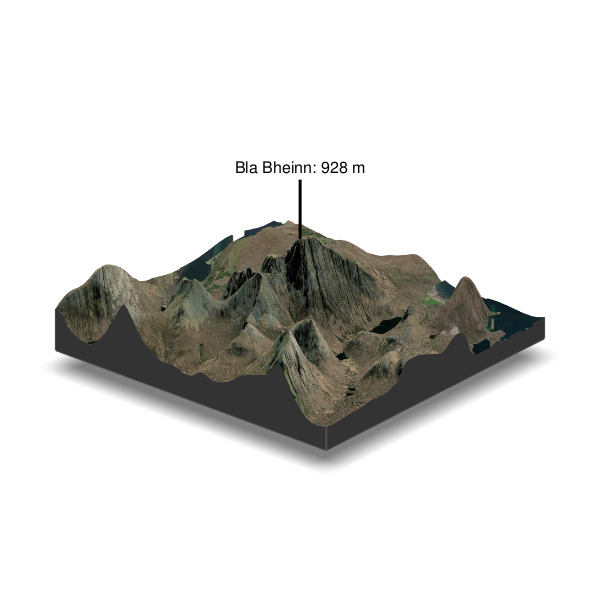
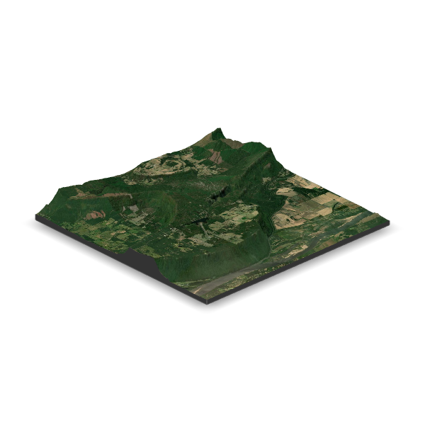
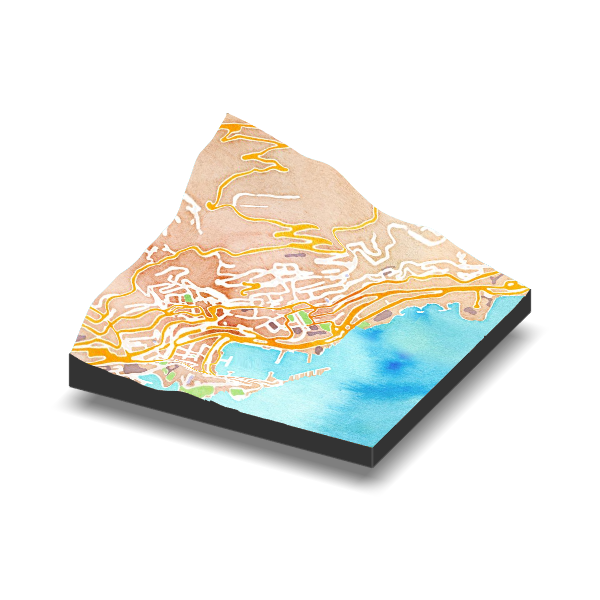

```{r setup, include = FALSE}
knitr::opts_chunk$set(
  warning = FALSE,
  message = FALSE,
  echo = FALSE,
  fig.retina = 3,
  fig.path = here::here("exports", "June", "/")
)

pacman::p_load(pacman, tidyverse, janitor, here, rio, job, skimr)

theme_set(theme_bw(base_size = 15))
```

# 20210601 - \#TidyTuesday and Survivor

```{r, include = F}
p_load(tidytuesdayR, survivoR, wesanderson)

#tt <- tt_load(x = "2021", week = "23")

tt <- survivoR::season_summary

```

```{r}
tt %>% 
  dplyr::select(season, starts_with("vie")) %>% 
  pivot_longer(-season) %>% 
  ggplot(aes(season, value, color = name)) + 
  geom_line() + 
  geom_point() + 
  labs(x = "Season", y = "Viewers (Millions)") + 
  scale_colour_manual(values = wesanderson::wes_palette("Moonrise1"), 
                        breaks = c("viewers_finale", "viewers_mean", "viewers_premier", "viewers_reunion"), 
                        labels = c("Finale", "Mean", "Premier", "Reunion")) +
  theme(legend.position = c(0.8, 0.8), legend.title = element_blank(), 
        legend.background = element_blank())
```

# 20210602 - Trying {rayvista} again

It works!

```{r, cuillins-rayvista-demo, include = F, eval = F}
library(rayshader) 
library(rayvista)

.lat <- 57.219566
.long <- -6.092690

cuillins <- plot_3d_vista(lat = .lat, long = .long, phi=30)

render_label(heightmap= cuillins, text='Bla Bheinn: 928 m', lat = .lat,
             long=.long, extent = attr(cuillins, 'extent'),altitude=600,
             clear_previous = T, zscale = 2)

render_compass()

render_scalebar(limits=c(
  round(dim(cuillins)[2]*attr(cuillins, 'resolution')/1000,1)),
  label_unit = 'km')

render_snapshot(filename = here("exports", "Cuillins.png"), clear=TRUE)

rgl::rgl.close()
```



```{r, petit-jean, include = F, eval = F}
library(rayshader) 
library(rayvista)

.lat <- 35.123422
.long <- -92.933233

location <- plot_3d_vista(lat = .lat, long = .long, phi=30)

render_snapshot(filename = here("exports", "PJSP.png"), clear=TRUE)

rgl::rgl.close()
```



```{r, petit-jean-2, include = F, eval = F}
library(rayshader) 
library(rayvista)

.lat <- 43.74029
.long <- 7.42629

location <- plot_3d_vista(lat = .lat, long = .long, phi=30, radius = 1500, 
                          fill_holes = T, elevation_detail = 14, overlay_detail = 15,
                          img_provider = "Stamen.Watercolor")

render_snapshot(filename = here("exports", "monaco.png"), clear=TRUE)

rgl::rgl.close()
```



# 20210603 - {skimr} and `tabyl`/`adorn` from {janitor}

```{r}
p_load(palmerpenguins)

penguins %>% 
  skim()

#browseURL("https://cran.r-project.org/web/packages/janitor/vignettes/tabyls.html")

penguins %>% 
  tabyl(species, sex) %>% 
  adorn_percentages("row") %>% 
  adorn_pct_formatting(digits = 2) %>%
  adorn_ns() %>% 
  flextable::flextable()

penguins %>% 
  tabyl(species, island) %>% 
  adorn_percentages("row") %>% 
  adorn_pct_formatting(digits = 2) %>%
  adorn_ns() %>% 
  flextable::flextable()

```

# 20210604 - Nothing

I did use `R` for work though.

# 20210607 - {gtsummary} and included `trial` dataset

```{r, gtsummary-setup, include = F}
p_load(gtsummary)

glimpse(trial)

#browseURL("http://www.danieldsjoberg.com/gtsummary/index.html")
```

```{r}
trial %>% 
  select(age, grade, response, trt) %>% 
  tbl_summary()

trial %>% 
  select(trt, age, grade, response) %>% 
  tbl_summary(by = trt, 
              missing = "no") %>% 
  add_p() %>% 
  add_n() %>% 
  modify_header(label = "**Variable**") %>% 
  bold_labels()

theme_gtsummary_journal(journal = "jama")
theme_gtsummary_compact()

trial %>% 
  select(trt, age, grade, response) %>% 
  tbl_summary(by = trt, 
              missing = "no") %>% 
  add_p() 

reset_gtsummary_theme()


trial %>%
  select(response, age, grade) %>%
  mutate(response = factor(response, labels = c("No Tumor Response", "Tumor Responded"))) %>%
  tbl_summary(
    by = response, 
    missing = "no",
    label = list(age ~ "Patient Age", grade ~ "Tumor Grade")
  ) %>%
  add_p(pvalue_fun = ~style_pvalue(.x, digits = 2)) %>%
  add_q()
```

# 20210608 - \#TidyTuesday and Fishing in the Great Lakes

```{r, include = F}
p_load(tidytuesdayR, viridis)

tt <- tt_load("2021-06-08")

fish <- tt$fishing

skim(fish)

glimpse(fish)

fish_tot <- fish %>% 
  filter(region %in% c("Canada (ONT)", "Total Canada (ONT)", 
                       "U.S. Total", "U.S. Total (MI)", "U.S. Total (NY)")) %>% 
  group_by(year, lake) %>% 
  mutate(total = sum(values, na.rm = T))

```

```{r}
fish_tot %>% 
  ggplot(aes(year, total, color = lake)) + 
  geom_point(size = 0.5) + 
  geom_smooth(method = "loess", se = F, alpha = 0.5, size = 0.75)

fish_tot %>% 
  ggplot(aes(year, total, color = lake)) + 
  geom_smooth(method = "gam", se = F) + 
  scale_color_viridis(discrete = T)

```

# 20210609 - Using {rayshader} again. With BSA

```{r, eval = F, include = F}
p_load(rayshader, sf, raster, elevatr, progressr)

topo_map <- raster::brick(here("Bull Shoals", "bsa_1893.tif")) %>% 
  raster::stack()

elevation1 <- get_elev_raster(topo_map, z = 13)

#browseURL("https://github.com/jhollist/elevatr/issues/38")

crs(elevation1)

elevation <- raster::crop(elevation1, extent(topo_map))

plot(elevation)

base_raster <- elevation * 0 + 100

longlat <- data.frame(
  long = c(-93, -93, -92.5, -92.5),
  lat = c(36 , 36.5, 36, 36.5)
)

S <- SpatialPoints(longlat, proj4string = CRS("+proj=longlat +ellps=clrk66 +datum=NAD27 +no_defs ")) %>% 
  spTransform(., crs(elevation))

interior_elevation <- raster::crop(elevation, extent(S))

elevation <- merge(interior_elevation, base_raster)

plot(elevation)

elev_mat <- raster_to_matrix(elevation)

```

```{r, include = F, eval = F}
names(topo_map) <- c("r", "g", "b")
topo_r <- rayshader::raster_to_matrix(topo_map$r)
topo_g <- rayshader::raster_to_matrix(topo_map$g)
topo_b <- rayshader::raster_to_matrix(topo_map$b)
topo_rgb_array <- array(0, dim = c(nrow(topo_r), ncol(topo_r), 3))

topo_rgb_array[,,1] <- topo_r/255
topo_rgb_array[,,2] <- topo_g/255
topo_rgb_array[,,3] <- topo_b/255

# Transpose map 
topo_rgb_array <- aperm(topo_rgb_array, c(2,1,3))
```

```{r, include = F, eval = F}
# elev_mat %>%
#   sphere_shade(texture = "bw") %>%
#   add_overlay(topo_rgb_array) %>%
#   add_shadow(ray_shade(elev_mat, sunaltitude = 50, zscale = 1, multicore = TRUE), max_darken = 0.7) %>%
#   add_shadow(ambient_shade(elev_mat, zscale = 10), 0.25) %>%
#   plot_map()

job::job({elev_mat %>%
  sphere_shade(texture = "bw", progbar = T) %>%
  add_overlay(topo_rgb_array) %>%
  add_shadow(ray_shade(elev_mat, sunaltitude = 75, zscale = 1, multicore = TRUE), max_darken = 0.7) %>%
  add_shadow(ambient_shade(elev_mat, zscale = 10), 0.25) %>%
  save_png(filename = "Bull Shoals/BSA.png")}
)

```


# 20210610 - Nothing

IT was working on my computer today.

# 20210611 - Fairbanks, AK and {rayshader}

```{r, eval = F, include = F}
p_load(rayshader, sf, raster, elevatr, progressr, magick)

topo_map <- raster::brick(here("fairbanks", "fairbanks_1950.tif")) %>% 
  raster::stack()

elevation1 <- get_elev_raster(topo_map, z = 10)

#browseURL("https://github.com/jhollist/elevatr/issues/38")

#elevation1 <- elevation1

crs(elevation1)

elevation <- raster::crop(elevation1, extent(topo_map))

plot(elevation1)

base_raster <- elevation * 0 + 100

longlat <- data.frame(
  long = c(-150, -150, -147, -147),
  lat = c(64 , 65, 64, 65)
)

S <- SpatialPoints(longlat, proj4string = CRS("+proj=longlat +ellps=clrk66 +datum=NAD27 +no_defs ")) %>% 
  spTransform(., crs(elevation))

interior_elevation <- raster::crop(elevation, extent(S))

elevation <- merge(interior_elevation, base_raster)

plot(elevation)

elev_mat <- raster_to_matrix(elevation)

```

```{r, include = F, eval = F}
names(topo_map) <- c("r", "g", "b")
topo_r <- rayshader::raster_to_matrix(topo_map$r)
topo_g <- rayshader::raster_to_matrix(topo_map$g)
topo_b <- rayshader::raster_to_matrix(topo_map$b)
topo_rgb_array <- array(0, dim = c(nrow(topo_r), ncol(topo_r), 3))

topo_rgb_array[,,1] <- topo_r/255
topo_rgb_array[,,2] <- topo_g/255
topo_rgb_array[,,3] <- topo_b/255

# Transpose map 
topo_rgb_array <- aperm(topo_rgb_array, c(2,1,3))
```

```{r, include = F, eval = F}
# elev_mat %>%
#   sphere_shade(texture = "bw") %>%
#   add_overlay(topo_rgb_array) %>%
#   add_shadow(ray_shade(elev_mat, sunaltitude = 50, zscale = 1, multicore = TRUE), max_darken = 0.7) %>%
#   add_shadow(ambient_shade(elev_mat, zscale = 10), 0.25) %>%
#   plot_map()

job::job({elev_mat %>%
  sphere_shade(texture = "bw", progbar = T) %>%
  add_overlay(topo_rgb_array) %>%
  add_shadow(ray_shade(elev_mat, sunaltitude = 75, zscale = 1, multicore = TRUE), max_darken = 0.7) %>%
  add_shadow(ambient_shade(elev_mat, zscale = 10), 0.25) %>%
  save_png(filename = "fairbanks/Fairbanks 1950.png")}
)

```


# 20210614 - Try {circlize} with HMO data from Nourish

```{r, include = F}
p_load(circlize, Hmisc, corrplot, rstatix)

#browseURL("https://jokergoo.github.io/circlize_book/book/index.html")

hmo <- import(here("data", "no_hmo.xlsx")) %>% 
  clean_names() %>% 
  select(1, 2, 5:26) %>% 
  mutate(secretor = case_when(secretor == 1 ~ "Secretor", 
                              TRUE ~ "Non-Secretor")) %>% 
  separate(id, into = c("id", "visit"))

hmo_cor <- hmo %>% 
  select_if(is.numeric)

test <- corrr::correlate(hmo_cor)

test2 <- cor(hmo_cor)

corrplot(corr = test2)

test3 <- test %>% 
  pivot_longer(-term) %>% 
  rename(from = term, to = name, cor = value) %>% 
  filter(!is.na(cor))

ps <- rcorr(as.matrix(hmo_cor))

flattenCorrMatrix <- function(cormat, pmat) {
  ut <- upper.tri(cormat)
  data.frame(
    row = rownames(cormat)[row(cormat)[ut]],
    column = rownames(cormat)[col(cormat)[ut]],
    cor  =(cormat)[ut],
    p = pmat[ut]
    )
}

final <- flattenCorrMatrix(ps$r, ps$P) %>% 
  adjust_pvalue(method = "BH") %>% 
  filter(p.adj <= 0.05) 

col_fun <- colorRamp2(range(final$cor), c("blue", "red"), transparency = 0.25)
```

```{r}
chordDiagram(final, row.col = row, column.col = column, col = col_fun, scale = F)
```


# 20210615 - #TidyTuesday and W.E.B. DuBois on Twitter

```{r, include = F}
p_load(tidytuesdayR, lubridate)

tt <- tt_load("2021-06-15")

tt_web <- tt$tweets %>% 
  mutate(day = day(datetime),
         month = month(datetime),
         year = year(datetime))

skim(tt_web)


tt_sum <- tt_web %>% 
  group_by(month, day) %>% 
  count() %>% 
  mutate(date = make_date(year = 2021, month = month, day = day))
```

```{r, include = F, eval = F}
tt_web %>% 
  ggplot(aes(long, lat, color = like_count)) + 
  geom_point() + 
  coord_sf()

```

```{r}
tt_sum %>% 
  ggplot(aes(date, n)) + 
  geom_line() + 
  labs(x = "Date", y = "Number of Tweets with #DuBoisChallenge")
```


# 20210616 - Trying {report} from {easystats}

```{r, include = F}
p_load(report, broom, car)
```

```{r, include = F}
lm1 <- mtcars %>% 
  lm(mpg ~ cyl + hp, data = .)

summary(lm1)
report(lm1)
report_table(lm1)
report(anova(lm1))
report(Anova(lm1))

lm2 <- mtcars %>% 
  lm(mpg ~ cyl*hp, data = .)

summary(lm2)
report(lm2)
report_table(lm2) %>% 
  flextable::flextable()
```

```{r}
report(lm1)

report_table(lm1)

report(lm2)

report_table(lm2)
```

# 20210617 - Nothing

Only used `R` for work projects.

# 20210618 - Trying {parameters} and {see} from {easystats}

```{r}
p_load(parameters, see, gt)


model <- lm(mpg ~ am * cyl, data = mtcars)

plot(parameters(model))

parameters(model) %>% 
  gt()

```

```{r}
model2 <- lm(disp ~ ., data = mtcars) %>% 
  select_parameters()

parameters(model2)

plot(parameters(model2))

model3 <- lm(Sepal.Length ~ .*., data = iris) %>% 
  select_parameters()

parameters(model3)

plot(parameters(model3))

```

# 20210621 - Nothing

# 20210622 - #TidyTuesdayR and Park Access

```{r, include = F}
p_load(tidytuesdayR, RColorBrewer)

tt <- tt_load("2021-06-22")

parks <- tt$parks


top10 <- parks %>% 
  filter(year == 2020) %>% 
  arrange(rank) %>% 
  head(10) %>% 
  mutate(group = "Top 10")

bottom10 <- parks %>% 
  filter(year == 2020) %>% 
  arrange(rank) %>% 
  tail(10) %>% 
  mutate(group = "Bottom 10")

parks_comp <- bind_rows(top10, bottom10)
```

```{r}
parks_comp %>% 
  ggplot(aes(reorder(city, total_points), total_points, color = group)) + 
  geom_point() + 
  coord_flip() + 
  labs(x = NULL)
```

# 20210623 - #TidyTuesdayR Comparing OKC and Minneapolis

```{r, include = F}
okc_mn <- parks %>% 
  filter(city %in% c("Oklahoma City", "Minneapolis")) %>% 
  filter(year != 2012) %>% 
  mutate(park_pct_city_data = as.numeric(gsub("[\\%,]", "", .$park_pct_city_data)),
         pct_near_park_data = as.numeric(gsub("[\\%,]", "", .$pct_near_park_data)),
         spend_per_resident_data= as.numeric(gsub("[\\$,]", "", .$spend_per_resident_data))) %>% 
  select(-city_dup)

okc_mn_l <- okc_mn |>  # new pipe
  pivot_longer(-c(city, year))

```

```{r}
okc_mn |>
  ggplot(aes(year, rank, color = city)) + 
  geom_point() + 
  geom_line() + 
  scale_y_reverse()

okc_mn_l|>
  ggplot(aes(name, value, color = as.factor(year))) + 
  geom_point() + 
  coord_flip() + 
  scale_color_brewer("Year", palette = "YlOrRd") +
  labs(x = NULL, y = NULL) + 
  facet_wrap(~ city)
```


# 20210624 - Nothing

`R` for work.

# 20210625 - Nothing

# 20210628 - Use {performance} to check models

```{r}
#browseURL("https://easystats.github.io/parameters/articles/parameters_selection.html")
```

```{r, include = F}
p_load(parameters, see, gt, performance)


model <- lm(mpg ~ am * cyl, data = mtcars)

model2 <- lm(disp ~ ., data = mtcars) %>% 
  select_parameters()

model3 <- lm(mpg ~ ., data = mtcars) %>% 
  select_parameters()
```

```{r}
check_normality(model)
check_normality(model2)
check_normality(model3)

check_heteroskedasticity(model)
check_heteroskedasticity(model2)
check_heteroskedasticity(model3)

check_autocorrelation(model)
check_autocorrelation(model2)
check_autocorrelation(model3)

check_collinearity(model)
check_collinearity(model2)
check_collinearity(model3)
```

```{r}
compare_performance(model, model3)

test_performance(model, model3)

```


# 20210629 - Nothing
# 20210630 - Nothing
# Knit Job

```{r, include = F, eval = F}
#job::job({knitr::knit(input = "June 2021.Rmd", output = "June 2021.html")})
```

# Ideas

template, gtsummary, officedown/officer, glue, tidymodels, ggsankey, gluedown, groundhog, ezknitr, rprojroot, colorspace, rgbif, polite (web scraping), geoviz, magick, ggmap, ggstream, rayvista, circlize, camcorder, {renv}, {rayvertex}, {labelled}, {ggradar}, {ggstatplots}, {report}, {insight}, {performance}, {parameters}, {correlation}, {easystats}, {hrbrthemes}, {firatheme}

<https://www.swisstopo.admin.ch/>

<https://www.ign.es/web/ign/portal/cbg-area-cartografia>

<http://shadedrelief.com/SampleElevationModels/>

<https://www.neonscience.org/resources/learning-hub/tutorials>

<https://docs.ropensci.org/rgbif/articles/rgbif.html>

<https://ryo-n7.github.io/2020-05-14-webscrape-soccer-data-with-R/>

<https://github.com/gkaramanis/aRt/blob/master/split-bar/split-bar.R>

<https://www.tidymodels.org/>

<https://rstudio.github.io/distill/basics.html>

<https://github.com/thebioengineer/camcorder>

# Extra

```{r, include = F, eval = F}
browseURL("https://www.datanovia.com/en/blog/how-to-create-a-map-using-ggplot2/")

```

elevatr - Examples in Vignette don't work.

```{r, eval = F, include = F}
library(elevatr)
library(osmdata)

bb <- getbb("North Little Rock") %>% 
  as.data.frame()

ll_prj <- "EPSG:4326"

get_elev_raster(bb, prj = ll_prj)

examp_df <- data.frame(x = runif(3, min = -73, max = -72.5), y = runif(3, min = 42, 
    max = 43))
prj_dd <- "+init=EPSG:4326"


elevation_df <- get_elev_raster(examp_df, prj = ll_prj, z = 5)
plot(elevation_df)


loc_df <- data.frame(x = runif(6,min=sp::bbox(lake)[1,1],
max=sp::bbox(lake)[1,2]),
y = runif(6,min=sp::bbox(lake)[2,1],
max=sp::bbox(lake)[2,2]))
x <- get_elev_raster(locations = loc_df, prj = sp::wkt(lake), z=10)
data(lake)
x <- get_elev_raster(lake, z = 12)
x <- get_elev_raster(lake, src = "gl3", expand = 5000)

```

### GitHub

```{r, eval = F, include = F}

usethis::use_git_config(user = "simscr", user.email = "simscr90@gmail.com")

```
